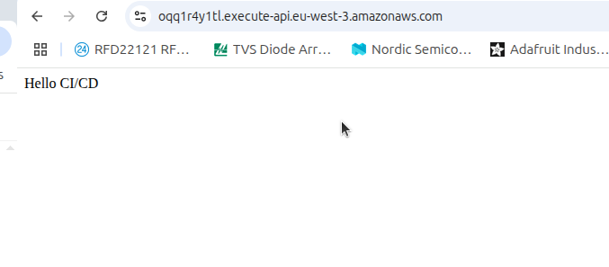

# Serverless Flask App with Terraform + GitHub Actions CI/CD + LocalStack

This project demonstrates a production-ready **AWS Lambda + API Gateway** setup, managed with **Terraform**, featuring **LocalStack** for local development and deployed through an advanced **GitHub Actions CI/CD pipeline**.  
The Lambda returns a basic `"Hello CI/CD"` message, showcasing an end-to-end workflow for infrastructure as code, local simulation, and automated cloud deployments.

---

## ✨ Features

- **Infrastructure as Code** — complete AWS stack defined in Terraform  
- **Dual CI/CD** — run locally with `act` + LocalStack **and** remotely on GitHub Actions  
- **Local Development** — no AWS account required thanks to LocalStack  
- **Security** — IAM roles, encrypted remote state, proper secret management  
- **State Management** — S3 backend + DynamoDB locking for team collaboration  
- **Testing** — Pytest integrated and executed in CI/CD

---

## 📁 Project Structure

```text
.
├── app/                          # Flask application
│   ├── app.py                    # Lambda handler function
│   ├── requirements.txt          # Python dependencies
│   └── tests/                    # Unit tests (pytest)
├── terraform/                    # Infrastructure as Code (Terraform)
│   ├── main.tf                   # Lambda, API Gateway, IAM, permissions
│   ├── provider.tf               # AWS provider (with LocalStack endpoints)
│   ├── backend.tf                # Remote backend (S3 + DynamoDB)
│   ├── variables.tf              # Input variables
│   ├── versions.tf               # Provider & Terraform version constraints
│   └── outputs.tf                # Outputs (API URL, Lambda ARN/name)
├── .github/workflows/            # CI/CD workflows
│   ├── ci.yaml                   # CI: tests + validation + plan (Local/LocalStack)
│   ├── cd.yaml                   # CD: deploy to AWS (S3 backend)
│   └── destroy.yaml              # Manual destroy
├── assets/
│   └── cicd_pipeline.png         # (Optional) pipeline diagram/screenshot
└── README.md


---

## Workflows

### 🔹 Continuous Integration (CI) – `.github/workflows/ci.yaml`
Runs on pull requests to main.

-Install Python deps
- Run pytest
- Build Lambda package (app.zip)
- terraform fmt (check)
- terraform validate
- terraform plan with local backend
 * With act locally → uses LocalStack (no AWS creds)
 * On GitHub → uses real AWS creds (from GitHub Secrets)

### 🔹 Continuous Deployment (CD) – `.github/workflows/cd.yaml`
- Runs on **push to `main`**.
- Runs tests again for safety.
- **Bootstraps Terraform backend** (S3 bucket + DynamoDB table if missing).
- Packages Flask app (or downloads artifact if available).
- Runs `terraform apply` → deploys:
  - Lambda function
  - API Gateway HTTP API
  - IAM Role + permissions
- Outputs your deployed **API Gateway URL**.

### 🔹 Destroy Workflow – `.github/workflows/destroy.yaml`
- Triggered manually (`workflow_dispatch`).
- Runs `terraform destroy` to remove all AWS resources.
- Cleans up local state files (if needed), but first you have to create a backup tfstate.

---

## Setup

### 1. Prerequisites
- [Terraform](https://developer.hashicorp.com/terraform/downloads) `>=1.1`
- AWS account with permissions for:
  - S3, DynamoDB, Lambda, API Gateway, IAM
- GitHub repository with:
  - `AWS_ACCESS_KEY_ID`
  - `AWS_SECRET_ACCESS_KEY`
  - `AWS_REGION`  
  stored as **Actions secrets**.

### 2. Deploy via GitHub Actions
- Merge or push to `main`.
- Wait for the **CD pipeline** to finish.
- Find your deployed API Gateway URL in the workflow logs:

```bash
terraform output api_url
https://oqq1r4y1tl.execute-api.eu-west-3.amazonaws.com/
```
Visit this URL → you should see: Hello CI/CD

